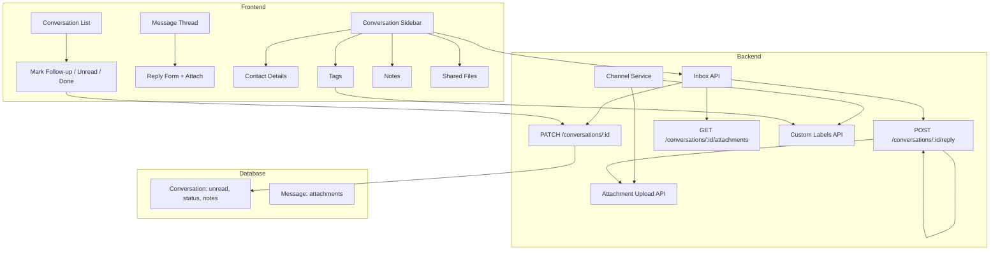

# Inbox Conversation Features Plan

## Overview

Implement conversation actions, a detail sidebar, and file attachments. Some features use the Facebook Graph API (Custom Labels, Attachment Upload); others are app-local (unread, notes).

---

## Architecture




---

## Phase 1: Schema and Backend Foundation

### 1.1 Schema Changes

**File:** [backend/prisma/schema.prisma](backend/prisma/schema.prisma)

Add to `Conversation` model:

```prisma
unread         Boolean  @default(false)
status         String   @default("inbox")  // inbox | follow_up | done
notes          String?
```

- `unread`: App-local (no Graph API for read/unread)
- `status`: Maps to "Follow Up" / "Done" in UI; optionally sync with FB Custom Labels
- `notes`: App-local (no Graph API for notes)

Run `prisma db push` or migration.

### 1.2 Update Conversation DTOs and Response

**New file:** `backend/src/inbox/dto/update-conversation.dto.ts`

```typescript
// Optional fields for PATCH
unread?: boolean;
status?: 'inbox' | 'follow_up' | 'done';
notes?: string;
```

**Update:** [backend/src/inbox/inbox.controller.ts](backend/src/inbox/inbox.controller.ts) - Add `PATCH /conversations/:id` with body validation.

**Update:** [backend/src/inbox/inbox.service.ts](backend/src/inbox/inbox.service.ts) - Add `updateConversation(orgId, id, dto)` that updates DB and optionally syncs status to FB Custom Labels.

---

## Phase 2: Conversation Actions UI

### 2.1 Conversation List Actions

**File:** [frontend/src/app/(dashboard)/dashboard/inbox/page.tsx](frontend/src/app/(dashboard)/dashboard/inbox/page.tsx)

Add a dropdown or action buttons on each conversation row (or in thread header when selected):

- **Mark as follow up** – `PATCH { id, status: 'follow_up' }`
- **Mark as unread** – `PATCH { id, unread: true }`
- **Move to done** – `PATCH { id, status: 'done' }`

Use [frontend/src/components/ui/dropdown-menu.tsx](frontend/src/components/ui/dropdown-menu.tsx) for actions.

### 2.2 Backend PATCH Endpoint

**File:** [backend/src/inbox/inbox.service.ts](backend/src/inbox/inbox.service.ts)

```typescript
async updateConversation(orgId, id, dto: { unread?, status?, notes? })
```

- Validate conversation belongs to org
- Update `Conversation` fields
- Emit SSE event for real-time UI refresh
- (Optional) Sync status to FB Custom Labels when `status` changes

### 2.3 API Client

**File:** [frontend/src/lib/api.ts](frontend/src/lib/api.ts)

- Add `unread`, `status`, `notes` to `Conversation` type
- Add `updateConversation(id, data)` function

---

## Phase 3: Conversation Detail Sidebar

### 3.1 Sidebar Layout

**File:** [frontend/src/app/(dashboard)/dashboard/inbox/page.tsx](frontend/src/app/(dashboard)/dashboard/inbox/page.tsx)

Use [frontend/src/components/ui/sheet.tsx](frontend/src/components/ui/sheet.tsx) for a collapsible right sidebar. When a conversation is selected, show:

- **Contact Details** – Name, profile pic, PSID (from `selectedConversation` / enriched profile)
- **Tags** – List of FB Custom Labels for this user; allow add/remove
- **Notes** – Textarea for `notes`; save on blur or explicit Save
- **Shared Files** – List of attachments from messages in conversation

Layout: `[Channels | Conversations | Thread | Sidebar]`

### 3.2 Contact Details

Reuse existing `participantName`, `participantProfilePic`, `participantId`. Optionally add more fields from User Profile API (e.g. `first_name`, `last_name`) in `getUserProfile` if needed.

### 3.3 Tags (FB Custom Labels)

**Backend:** Add to [backend/src/channel/channel.service.ts](backend/src/channel/channel.service.ts):

- `listCustomLabels(pageId, token)` – `GET /{page-id}/custom_labels?fields=page_label_name`
- `createCustomLabel(pageId, token, name)` – `POST /{page-id}/custom_labels?page_label_name=...`
- `getLabelsForUser(psid, token)` – `GET /{psid}/custom_labels?fields=page_label_name`
- `assignLabelToUser(labelId, psid, token)` – `POST /{label-id}/label?user={psid}`
- `removeLabelFromUser(labelId, psid, token)` – `DELETE /{label-id}/label?user={psid}`

**Inbox endpoints:**

- `GET /conversations/:id/labels` – list labels for participant
- `POST /conversations/:id/labels` – assign label (body: `{ labelId }` or `{ labelName }` create-if-missing)
- `DELETE /conversations/:id/labels/:labelId` – remove label

**Permissions:** `pages_me`, `pages_manage_metadata`, `pages_show_list` (may need App Review).

### 3.4 Notes

- Store in `Conversation.notes`
- `PATCH /conversations/:id` with `{ notes }` when user saves
- Sidebar: textarea bound to `notes`, debounced save or Save button

### 3.5 Shared Files

**Backend:** Add `GET /conversations/:id/attachments` in [backend/src/inbox/inbox.service.ts](backend/src/inbox/inbox.service.ts):

- Query messages for conversation with `attachments IS NOT NULL`
- Parse attachments JSON, collect `{ type, payload: { url } }` from each message
- Return flattened list: `{ type, url }[]`

**Frontend:** Sidebar section lists files with links to open in new tab. Group by type (image, video, file) if desired.

---

## Phase 4: File Attachments in Reply

### 4.1 Attachment Upload API

**File:** [backend/src/channel/channel.service.ts](backend/src/channel/channel.service.ts)

Add `uploadAttachment(pageId, token, file)`:

1. Use `POST /me/message_attachments` with multipart or URL-based upload
2. Payload: `{ message: { attachment: { type, payload: { url } } } }` for URL
3. Return `attachment_id` from response

**Reference:** [Attachment Upload API](https://developers.facebook.com/docs/messenger-platform/reference/attachment-upload-api/)

### 4.2 Reply with Attachment

**File:** [backend/src/inbox/inbox.service.ts](backend/src/inbox/inbox.service.ts)

Extend `reply` to accept optional `attachmentUrl` or `attachmentId`:

- If `attachmentUrl`: upload via Attachment Upload API, get `attachment_id`
- Send message: `{ attachment: { type: "image", payload: { attachment_id } } }` (or `type: "file"` for documents)

**File:** [backend/src/inbox/dto/reply.dto.ts](backend/src/inbox/dto/reply.dto.ts)

```typescript
text?: string;           // optional if attachment
attachmentUrl?: string;  // URL to upload
```

Validate: at least one of `text` or `attachmentUrl` required.

### 4.3 Frontend Reply Form

**File:** [frontend/src/app/(dashboard)/dashboard/inbox/page.tsx](frontend/src/app/(dashboard)/dashboard/inbox/page.tsx)

- Add attachment button (paperclip icon) next to send
- File input (hidden); on select, show file name
- On send: if file selected, upload to backend first (new endpoint or multipart reply), then send with `attachmentUrl` or `attachmentId`
- For URL-based upload: backend needs a temporary URL. Options: (a) client uploads file to your storage first, then passes URL; (b) client sends file as multipart; backend receives file, uploads to FB, then sends message.

**Simpler approach:** Add `POST /conversations/:id/upload-attachment` that accepts multipart file, uploads to FB, returns `attachment_id`. Then `POST /conversations/:id/reply` accepts `{ text?, attachmentId? }`. Frontend: upload file → get attachmentId → call reply with attachmentId.

---

## Phase 5: Webhook and Unread State

### 5.1 Inbound Messages

**File:** [backend/src/webhook/webhook.service.ts](backend/src/webhook/webhook.service.ts)

When creating/updating conversation for new inbound message, set `unread: true`.

### 5.2 Mark as Read

When user opens/views a conversation, call `PATCH { unread: false }`. Optionally trigger on view (e.g. when conversation is selected).

---

## Files to Create/Modify


| File                                                                                                           | Action                                                                    |
| -------------------------------------------------------------------------------------------------------------- | ------------------------------------------------------------------------- |
| [backend/prisma/schema.prisma](backend/prisma/schema.prisma)                                                   | Add unread, status, notes to Conversation                                 |
| [backend/src/inbox/dto/update-conversation.dto.ts](backend/src/inbox/dto/update-conversation.dto.ts)           | Create                                                                    |
| [backend/src/inbox/dto/reply.dto.ts](backend/src/inbox/dto/reply.dto.ts)                                       | Add attachmentId, attachmentUrl                                           |
| [backend/src/inbox/inbox.controller.ts](backend/src/inbox/inbox.controller.ts)                                 | Add PATCH, GET attachments, labels endpoints                              |
| [backend/src/inbox/inbox.service.ts](backend/src/inbox/inbox.service.ts)                                       | Add updateConversation, getAttachments, reply with attachment             |
| [backend/src/channel/channel.service.ts](backend/src/channel/channel.service.ts)                               | Add Custom Labels + Attachment Upload                                     |
| [backend/src/webhook/webhook.service.ts](backend/src/webhook/webhook.service.ts)                               | Set unread on new message                                                 |
| [frontend/src/lib/api.ts](frontend/src/lib/api.ts)                                                             | Add types, updateConversation, reply with attachment, labels, attachments |
| [frontend/src/app/(dashboard)/dashboard/inbox/page.tsx](frontend/src/app/(dashboard)/dashboard/inbox/page.tsx) | Actions, sidebar, attach file                                             |


---

## Facebook Graph API Requirements


| Feature              | Endpoint                                                                 | Permissions                                      |
| -------------------- | ------------------------------------------------------------------------ | ------------------------------------------------ |
| Custom Labels        | `/{page-id}/custom_labels`, `/{label-id}/label`, `/{psid}/custom_labels` | pages_me, pages_manage_metadata, pages_show_list |
| Attachment Upload    | `POST /me/message_attachments`                                           | pages_messaging                                  |
| Send with attachment | `POST /me/messages` with attachment payload                              | pages_messaging                                  |


---

## Implementation Order

1. Schema + migration
2. PATCH conversation, updateConversation service
3. Conversation actions UI (mark follow-up, unread, done)
4. Sidebar shell (Sheet) + Contact Details + Notes
5. Shared files (attachments endpoint + sidebar)
6. Custom Labels backend + Tags sidebar
7. Attachment upload + reply with file
8. Webhook unread on new message

---

## Testing Checklist

- Mark as follow up / done updates status and UI
- Mark as unread shows indicator; viewing clears it
- Notes save and persist
- Shared files list shows all attachments
- Tags can be assigned/removed (if FB permissions granted)
- File attachment sends successfully
- New inbound message sets unread

