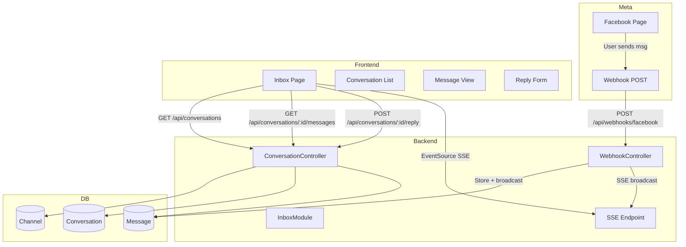

# Inbox with Facebook Messenger Integration

## Architecture Overview

---

## Phase 1: Database Schema

Add to [backend/prisma/schema.prisma](backend/prisma/schema.prisma):

**Channel** – Connected Facebook/Instagram Page per organization

- `id`, `organizationId`, `type` (facebook | instagram), `pageId`, `pageName`, `pageAccessToken` (encrypted), `instagramAccountId?`, `status`, `createdAt`, `updatedAt`
- `@@unique([organizationId, type, pageId])`

**Conversation** – Thread with a customer

- `id`, `channelId`, `externalId` (Graph API conversation ID), `participantId` (PSID), `participantName?`, `lastMessageAt`, `createdAt`, `updatedAt`
- `@@unique([channelId, externalId])`

**Message** – Individual message

- `id`, `conversationId`, `externalId`, `direction` (inbound | outbound), `content` (text), `attachments?` (JSON), `metadata?` (JSON), `createdAt`
- `@@index([conversationId])`

Extend [backend/src/prisma/prisma.service.ts](backend/src/prisma/prisma.service.ts) with tenant-scoping for `Channel`, `Conversation`, `Message` (via `organizationId` through Channel).

---

## Phase 2: Backend – Channel Connection

**New module:** `backend/src/channel/`

- `ChannelModule`, `ChannelController`, `ChannelService`
- `POST /api/channels` – Connect channel (body: `type`, `pageId`, `pageName`, `pageAccessToken`)
- `GET /api/channels` – List connected channels
- `DELETE /api/channels/:id` – Disconnect
- Protected by `TenantGuard`; validate token with `GET /{page-id}?fields=name` before storing

**Security:** Store `pageAccessToken` encrypted (e.g. AES-256 with `BETTER_AUTH_SECRET` or dedicated `ENCRYPTION_KEY`). Add `@nestjs/config` validation for new env vars.

---

## Phase 3: Backend – Webhook Endpoint

**New:** `backend/src/webhook/`

- `WebhookModule`, `WebhookController`
- **GET** `/api/webhooks/facebook` – Verification: check `hub.mode=subscribe`, `hub.verify_token` (from env), return `hub.challenge`
- **POST** `/api/webhooks/facebook` – Event handler:
  - Validate `X-Hub-Signature-256` with `APP_SECRET` (HMAC-SHA256)
  - Parse `object` (page | instagram), `entry[].messaging`
  - Handle `messages` events: extract `sender.id`, `recipient.id`, `message.text`, `message.mid`
  - Find Channel by `recipient.id` (pageId), create/update Conversation, insert Message
  - Return 200 OK within 5 seconds (process async if needed)
- **Skip auth** – Webhooks are public; use `@SkipTenant()`, `@AllowAnonymous()` or equivalent
- **Body parsing** – Webhook route needs raw body for signature validation. Use `bodyParser: false` only for webhook path or add `express.raw()` for `/webhooks/`*

**Env:** `FACEBOOK_APP_SECRET`, `FACEBOOK_WEBHOOK_VERIFY_TOKEN`, `WEBHOOK_BASE_URL` (e.g. `https://xxx.ngrok.io`)

---

## Phase 4: Backend – Conversations API

**New:** `backend/src/inbox/` (or extend channel)

- `InboxController`, `InboxService`
- `GET /api/conversations?channelId=` – List conversations (from DB, ordered by `lastMessageAt`)
- `GET /api/conversations/:id` – Conversation detail + messages (paginated)
- `POST /api/conversations/:id/reply` – Send reply (body: `text`)
  - Resolve Conversation → Channel, get `pageAccessToken`
  - `POST https://graph.facebook.com/v25.0/{pageId}/messages` with `recipient.id`, `message.text`, `messaging_type: RESPONSE`
  - Store outbound Message in DB
- Protected by `TenantGuard`

**Sync from Graph API:** On first load of conversations for a channel, optionally fetch from `GET /{page-id}/conversations` and merge into DB (for existing threads).

---

## Phase 5: Real-Time Updates (SSE)

**Option A – SSE (recommended):**

- `GET /api/inbox/events` – Server-Sent Events stream
- Auth: pass session cookie; validate and attach `organizationId`
- When webhook receives new message: emit event to all connected clients for that org
- Use in-memory `EventEmitter` or `BroadcastChannel` for single-instance; for multi-instance use Redis Pub/Sub later

**Option B – Polling (fallback):**

- Frontend polls `GET /api/conversations` every 5 seconds when inbox is open
- Simpler, no SSE infra

**Plan:** Implement SSE first. Store last event ID for reconnection.

---

## Phase 6: Frontend – Inbox UI

**Pages/components:**

- [frontend/src/app/(dashboard)/dashboard/inbox/page.tsx](frontend/src/app/\(dashboard)/dashboard/inbox/page.tsx) – Main inbox layout
- **Connect Channel** – Modal/section to add channel: form with `Page ID`, `Page Access Token`, `Page Name` (or fetch name via API). Link to Meta Developer docs for obtaining token.
- **Channel list** – Show connected channels; disconnect button
- **Conversation list** – Left panel: conversations sorted by `lastMessageAt`, preview, unread indicator (optional)
- **Message view** – Right panel: messages in thread, reply input, send button
- **Empty state** – When no channels: prompt to connect

**Real-time:** Use `EventSource` to `GET /api/inbox/events`; on `message` event, refetch conversations or append new message to current thread.

**Responsive:** Collapsible sidebar on mobile; conversation list / message view toggle.

---

## Phase 7: ngrok Setup for Local Dev

**Docs/script:**

- Add `WEBHOOK_BASE_URL` to [backend/.env.example](backend/.env.example)
- README section: run `ngrok http 3001`, set `WEBHOOK_BASE_URL=https://xxx.ngrok.io`, configure Meta App Dashboard webhook URL to `{WEBHOOK_BASE_URL}/api/webhooks/facebook`
- Verify token: `FACEBOOK_WEBHOOK_VERIFY_TOKEN` (random string, set in Meta Dashboard)

---

## API Reference (Graph API v25.0)

| Action             | Endpoint                          | Notes                                                             |

| ------------------ | --------------------------------- | ----------------------------------------------------------------- |

| List conversations | `GET /{page-id}/conversations`    | Cursor pagination                                                 |

| Get messages       | `GET /{conversation-id}/messages` | Conversation ID from list                                         |

| Send message       | `POST /{page-id}/messages`        | `recipient.id` = PSID, `message.text`, `messaging_type: RESPONSE` |

| Page info          | `GET /{page-id}?fields=name`      | Validate token                                                    |

**Webhook object types:** `page` (Facebook), `instagram` (Instagram Messaging). Same structure; `entry[].id` is page/IG account ID.

---

## File Summary

| Layer    | New/Modified Files                                                                          |

| -------- | ------------------------------------------------------------------------------------------- |

| Prisma   | `schema.prisma` – Channel, Conversation, Message                                            |

| Backend  | `channel/`, `webhook/`, `inbox/` modules                                                    |

| Backend  | `main.ts` – Raw body for webhook route                                                      |

| Frontend | `inbox/page.tsx`, `ConnectChannelModal`, `ConversationList`, `MessageThread`, `ReplyForm`   |

| Shared   | `types` for Channel, Conversation, Message                                                  |

| Config   | `.env.example` – `FACEBOOK_APP_SECRET`, `FACEBOOK_WEBHOOK_VERIFY_TOKEN`, `WEBHOOK_BASE_URL` |

---

## Out of Scope (Later)

- Instagram Messaging (different webhook object; same pattern)
- WhatsApp (different API)
- OAuth flow for token (use manual token for dev)
- AI auto-reply
- Message read receipts, typing indicators